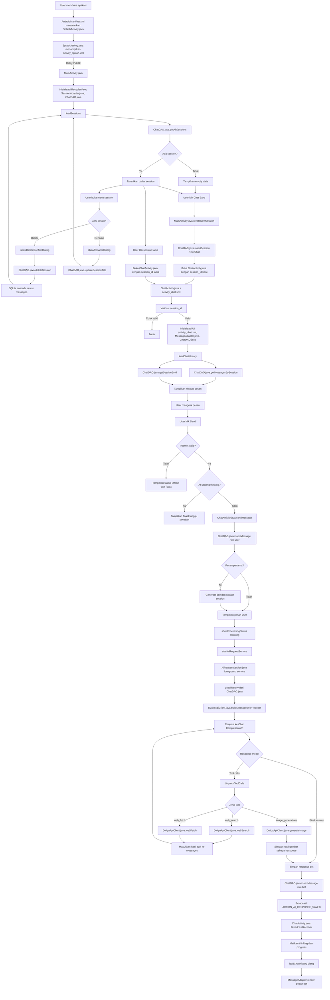
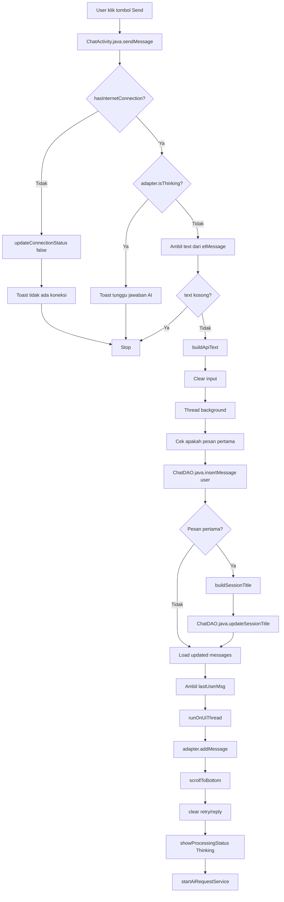
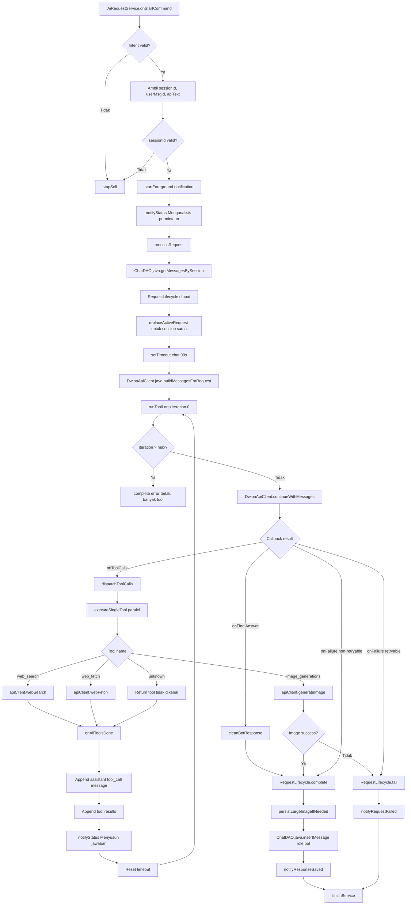
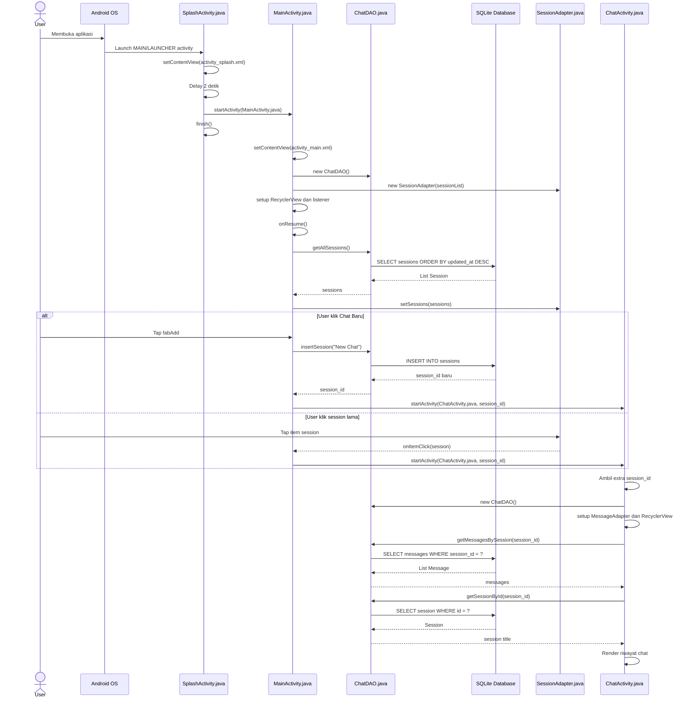
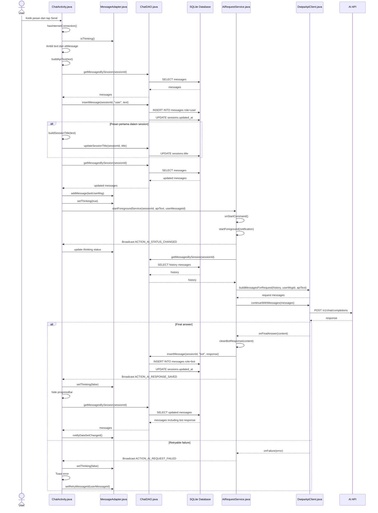
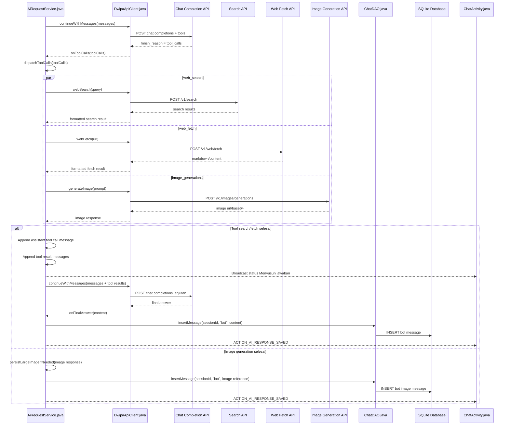
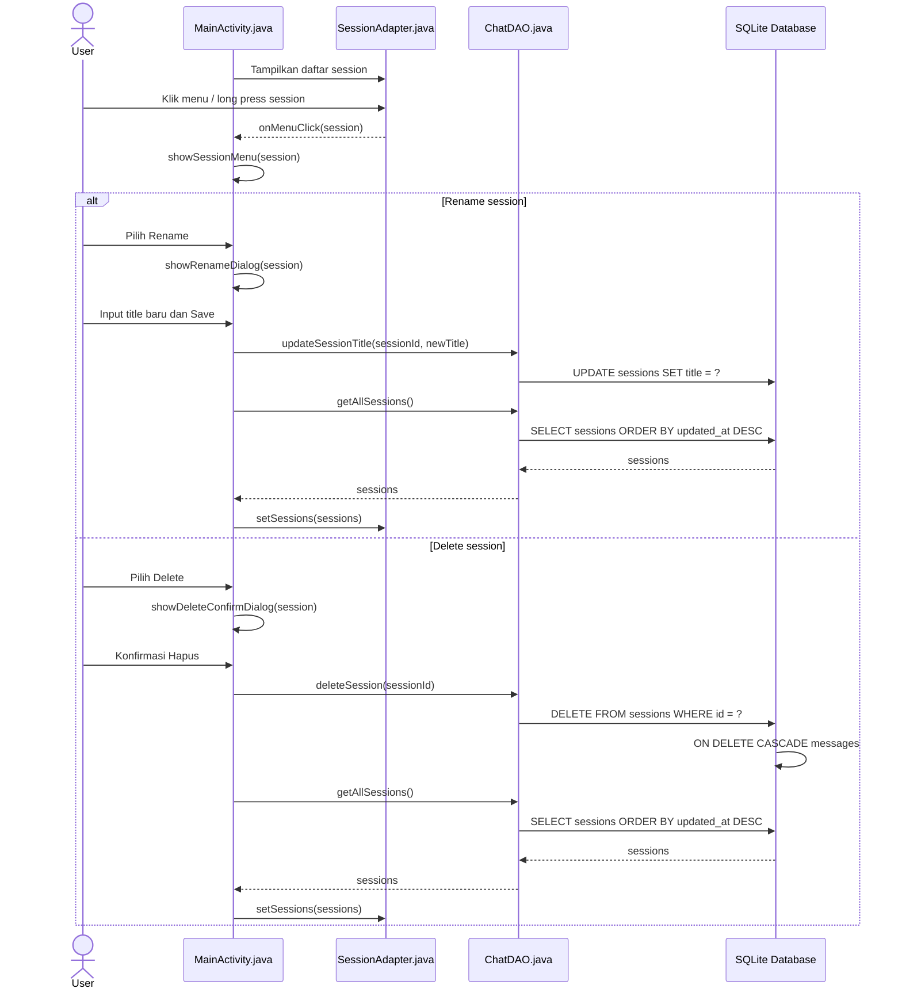

# Flow Aplikasi Chatbot

Dokumen ini merangkum alur aplikasi dari splash screen, daftar sesi, halaman chat, pemrosesan AI, penyimpanan database, sampai response tampil kembali di UI.

## Flowchart Utama



## Flowchart Pengiriman Pesan



## Flowchart AI Service dan Tool Calling



## Sequence Diagram: App Launch sampai Chat Screen



## Sequence Diagram: Kirim Pesan dan Terima Jawaban AI



## Sequence Diagram: Tool Calling



## Sequence Diagram: Rename dan Delete Session



## Ringkasan Fungsi per File dan Ekstensi

| File | Ekstensi | Jenis | Fungsi utama |
|---|---:|---|---|
| `AndroidManifest.xml` | `.xml` | Manifest Android | Menentukan permission, launcher activity, service, dan activity app |
| `activity_splash.xml` | `.xml` | Layout XML | Tampilan splash screen |
| `activity_main.xml` | `.xml` | Layout XML | Tampilan halaman daftar session |
| `activity_chat.xml` | `.xml` | Layout XML | Tampilan halaman percakapan chat |
| `item_session.xml` | `.xml` | Layout XML | Tampilan satu item session di RecyclerView |
| `item_message_user.xml` | `.xml` | Layout XML | Tampilan bubble pesan user |
| `item_message_bot.xml` | `.xml` | Layout XML | Tampilan bubble pesan bot |
| `item_message_thinking.xml` | `.xml` | Layout XML | Tampilan indikator AI sedang berpikir |
| `bottom_sheet_session_actions.xml` | `.xml` | Layout XML | Tampilan menu rename/delete session |
| `dialog_rename_session.xml` | `.xml` | Layout XML | Tampilan dialog rename session |
| `SplashActivity.java` | `.java` | Activity Java | Menampilkan splash screen lalu membuka `MainActivity` |
| `MainActivity.java` | `.java` | Activity Java | Menampilkan daftar session, membuat session baru, rename, delete |
| `ChatActivity.java` | `.java` | Activity Java | Menampilkan chat, mengirim pesan, menerima broadcast dari service |
| `SessionAdapter.java` | `.java` | RecyclerView Adapter Java | Render item session dan callback klik/menu session |
| `MessageAdapter.java` | `.java` | RecyclerView Adapter Java | Render pesan user, bot, thinking, image, code block, retry/reply |
| `AiRequestService.java` | `.java` | Foreground Service Java | Service untuk request AI, tool calling, dan simpan response |
| `DwipaApiClient.java` | `.java` | API Client Java | HTTP client untuk chat API, search, fetch, dan image generation |
| `ChatDAO.java` | `.java` | Data Access Object Java | Operasi database untuk sessions dan messages |
| `DatabaseHelper.java` | `.java` | SQLiteOpenHelper Java | Membuat dan mengatur schema SQLite |
| `Session.java` | `.java` | Model Java | Model data session |
| `Message.java` | `.java` | Model Java | Model data message |
| `build.gradle.kts` | `.kts` | Gradle Kotlin Script | Konfigurasi build module/root project |
| `settings.gradle.kts` | `.kts` | Gradle Kotlin Script | Konfigurasi nama project, repository, dan module `:app` |
| `libs.versions.toml` | `.toml` | Version Catalog | Daftar versi dependency dan plugin Gradle |

## Keterangan Ekstensi File

| Ekstensi | Digunakan untuk |
|---|---|
| `.java` | Source code Java: Activity, Service, Adapter, DAO, model, dan API client |
| `.xml` | Android Manifest, layout UI, drawable, theme, colors, strings, dan resource Android lainnya |
| `.kts` | Gradle Kotlin Script untuk konfigurasi build |
| `.toml` | Version catalog Gradle untuk dependency dan plugin |
| `.md` | Dokumentasi Markdown seperti file flow ini |

## Ringkasan Alur Akhir

```text
AndroidManifest.xml
→ SplashActivity.java + activity_splash.xml
→ MainActivity.java + activity_main.xml
→ SessionAdapter.java / ChatDAO.java / SQLite Database
→ ChatActivity.java + activity_chat.xml
→ MessageAdapter.java / ChatDAO.java / SQLite Database
→ AiRequestService.java
→ DwipaApiClient.java
→ API chat / tools / image
→ AiRequestService.java simpan response
→ Broadcast ke ChatActivity.java
→ ChatActivity.java reload history
→ MessageAdapter.java tampilkan jawaban
```
